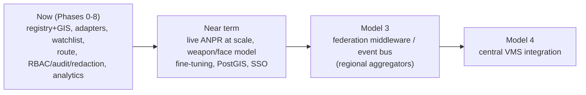

# Cost-Benefit, Department Information Requirements & Roadmap

Companion to the [HLD](HLD.md) and [Scale-Up Plan](SCALEUP.md).

---

## 1. Cost-benefit analysis

### Why it's cost-effective
- **Reuses existing CCTV** — no new camera hardware; the heterogeneous ingestion adapters
  (RTSP/ONVIF/MJPEG/analog-via-encoder) onboard what's already installed across departments.
- **Open-source core** — Ultralytics YOLO, ByteTrack, OpenCV, FastAPI, Next.js, SQLite/Postgres.
  No per-seat VMS or per-analytic licensing; spend is hardware + integration, not licences.
- **Edge processing** removes the dominant recurring cost — statewide video backhaul — by
  ~99%+ (see [SCALEUP §2](SCALEUP.md#2-network--bandwidth--the-edge-processing-argument)).

### Indicative cost bands (statewide, ~80k cameras)

| Category | Driver | Band |
|---|---|---|
| CAPEX — edge compute | ~2,000–4,000 inference GPUs across ~800–1,600 edge nodes | Largest CAPEX line |
| CAPEX — edge storage | 30-day local video (distributed, ~PB-scale at the edge, not central) | Medium |
| CAPEX — regional/state | ~30–40 aggregators + DC + DR site | Medium |
| OPEX — network | Metadata + on-demand clips only (edge-first) | **Low** (vs. centralized video) |
| OPEX — software | Open-source stack; support/maintenance staff | Low licence, medium staff |
| OPEX — power/cooling | Edge + DC | Medium |

*(Exact figures depend on procurement; the point is that edge-first + open-source shifts cost
from recurring backhaul/licences to one-time compute, and reuses installed cameras.)*

### Benefits (quantifiable & qualitative)
- **Faster investigations** — cross-camera route reconstruction turns hours of manual footage
  review into a plate query returning an ordered, mapped path.
- **Proactive interception** — watchlist matching + real-time alerts instead of after-the-fact
  review.
- **Force multiplier** — one operator monitors many feeds; tampering/health detection flags dead
  or blinded cameras automatically (a common silent failure).
- **Compliance & trust** — department RBAC, a full audit trail, and privacy-preserving redaction
  are built in, not bolted on.
- **Interoperability** — integration-ready APIs (see [API.md](API.md)) let existing department
  systems consume events.

---

## 2. Department-wise information requirements (representative, ~26)

Access is enforced by **department RBAC** (a user only sees their department's cameras;
admins see all). The matrix below is representative of the ~26 departments/units a statewide GSP
deployment spans — each row is a department scope in the registry.

| # | Department / Unit | Primary information from PRAHARI |
|---|---|---|
| 1 | Traffic Police | ANPR, vehicle route reconstruction, congestion/incident alerts |
| 2 | City / Commissionerate Police | Zone intrusion, behavior alerts, watchlist matches |
| 3 | Rural / District Police | Camera registry + GIS coverage, event history |
| 4 | Crime Branch | Route reconstruction, watchlist, face-watch (verify) |
| 5 | Anti-Terrorism Squad (ATS) | Watchlist, cross-camera correlation, weapon alerts |
| 6 | Special Operations Group | Real-time alerts, live viewing |
| 7 | Highway / Traffic Safety | ANPR corridors, speed/transit anomalies (topology) |
| 8 | Railway Police (GRP) | Crowd/loitering, unattended-object (roadmap), watchlist |
| 9 | Coastal / Marine Police | Perimeter zones, vehicle/vessel-adjacent monitoring |
| 10 | Border / BSF-liaison posts | Fence/zone intrusion, climbing/crawling, night vision |
| 11 | Home Guard | Assisted monitoring, event history |
| 12 | State Reserve Police (SRP) | Deployment-area live viewing, alerts |
| 13 | Women Safety / Abhayam | Snatching/altercation behavior alerts, priority zones |
| 14 | Cyber Crime | Case-linked evidence export (redacted) |
| 15 | Economic Offences Wing | Suspect vehicle/person route history |
| 16 | Prisons / Jail security | Perimeter tamper/health, intrusion |
| 17 | Forensic Science Lab | Evidence-grade clip export with audit |
| 18 | Intelligence Bureau (state) | Watchlist, correlation, restricted access |
| 19 | Disaster Management / SDRF | Situational live viewing, crowd density |
| 20 | Fire & Emergency Services | Live viewing at incidents |
| 21 | Excise / Prohibition | Vehicle watchlist, route history |
| 22 | Transport / RTO liaison | ANPR data sharing (plate events) |
| 23 | Municipal / Smart City ICCC | Shared camera registry + GIS layers |
| 24 | Elections / Law & Order cells | Event-time monitoring, audit |
| 25 | VIP / Static security | Watchlist + face-watch (verify), zone alerts |
| 26 | GSP HQ / Command Centre (admin) | Statewide registry, all cameras, audit, analytics |

Each department gets exactly the scope its role and department entitle it to — the same
mechanism demonstrated by the seeded viewer/operator/admin logins.

---

## 3. Future roadmap

### Near term (hardening the built system)
- Train/fine-tune the **weapon** and **face** models to activate those already-wired stages.
- Install PaddleOCR at the edge for **live ANPR** (the pipeline hook already exists).
- Migrate registry/GIS to **PostgreSQL + PostGIS**; central IdP / **SSO** for auth.
- Curated **road-topology graphs** per region to sharpen route plausibility.

### Model 3 — Federation middleware / event bus (future)
A regional aggregation tier: an event bus (Kafka/NATS) collecting edge events, cross-node Re-ID
and route correlation, and on-demand video proxying. **The ingestion adapter contract is already
the seam this plugs into** — deliberately designed forward-compatible, not built here.

### Model 4 — Central VMS (future)
Full central video-management-system integration (unified recording, PTZ control, video walls,
long-term managed retention) layered on top of the federation tier.

> Model 3 and Model 4 are explicitly **future phases**, not part of the current build — the
> current architecture is Model 1 + Model 2, shaped so those tiers can be added without
> re-architecting the core.
