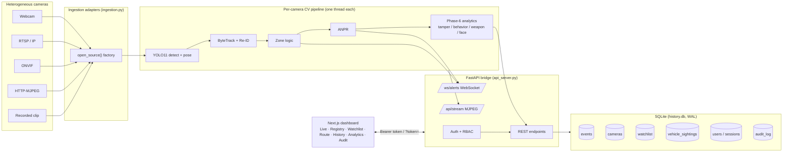
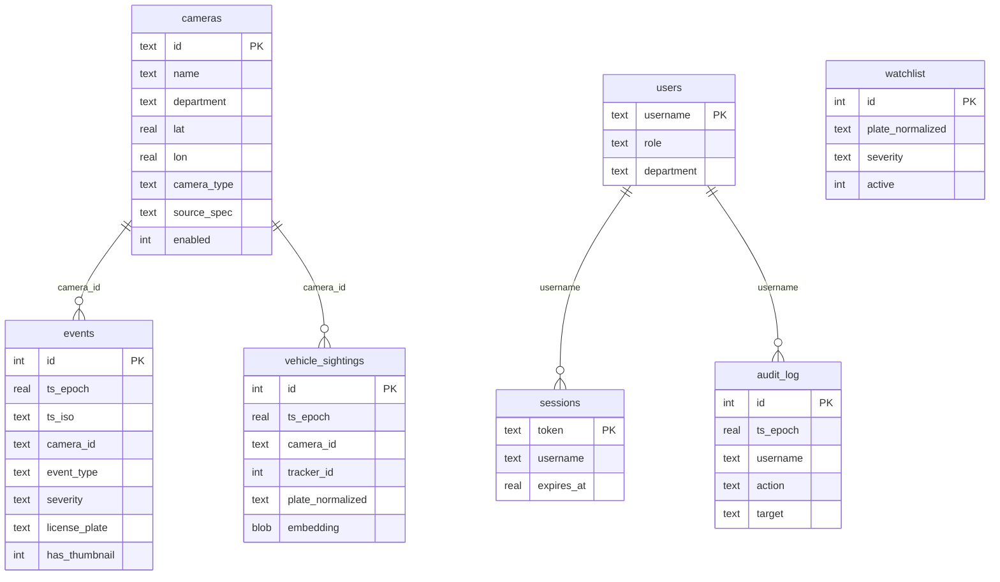
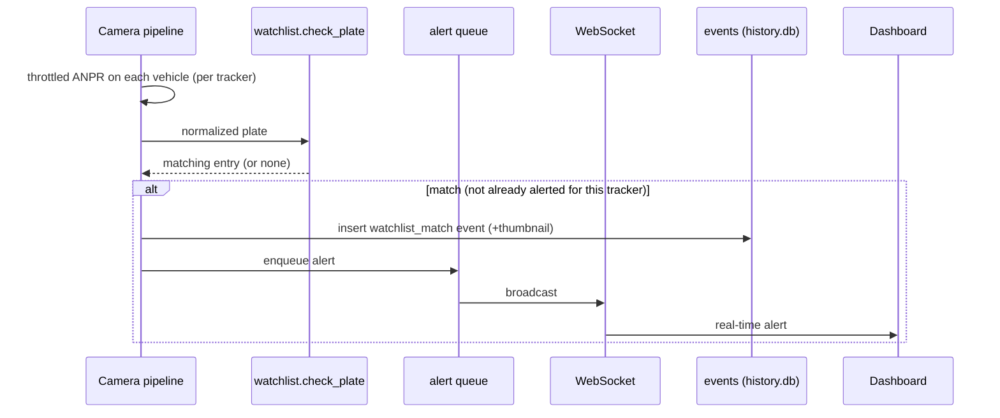
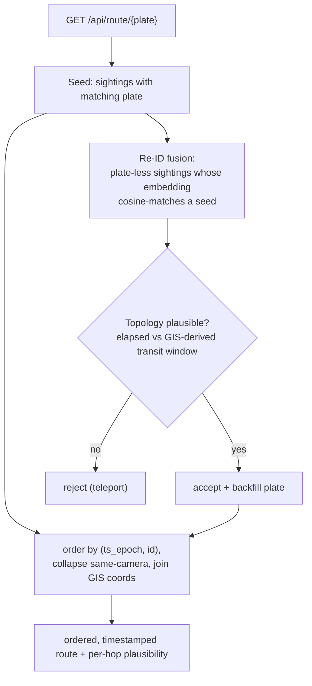
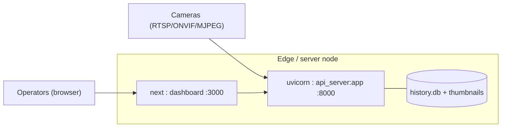

# PRAHARI / IBVAP — High-Level Design (HLD)

**Statewide CCTV analytics for Gujarat State Police.** This document describes the system
architecture, the data model, and the principal flows (ingestion, watchlist matching, and
cross-camera route reconstruction), and maps them to the hackathon's reference models.

---

## 1. Scope & model mapping

| Reference model | Description | This build |
|---|---|---|
| **Model 1 — Registry & GIS** | Central inventory of cameras with GIS + health/RBAC | **Built** — camera registry, Leaflet GIS, RBAC, health monitoring |
| **Model 2 — Unified viewing (direct)** | Direct per-camera ingestion, no intermediary tier | **Built** — one worker per camera, MJPEG + WebSocket to the dashboard |
| **Model 3 — Federation middleware / event bus** | An intermediary tier aggregating edge nodes | **Future** — the ingestion adapter layer is deliberately shaped to be federation-ready (see §4) |
| **Model 4 — Central VMS** | A full central video-management platform | **Future** — roadmap only |

The ingestion adapter layer is designed as the seam a future federation tier would plug into: a
remote edge node only has to speak the same *frame contract* the pipeline already consumes.

---

## 2. System architecture



**Why direct ingestion (Model 2):** each camera runs its own `CameraWorker` thread with its own
capture, detector/tracker state, and zone list. A stall or crash on one camera can't affect
another, and there is no shared decode to become a bottleneck. This matches Model 2 and is the
natural unit to later distribute across edge nodes (Model 3).

---

## 3. Component overview

| Layer | Module(s) | Responsibility |
|---|---|---|
| Ingestion | `ingestion.py` | `VideoSource` (cv2), `MjpegHttpSource`, ONVIF resolver, `open_source()` factory |
| Detection | `detector.py` | YOLO11 person/vehicle + YOLO11-pose keypoints (serialized model load) |
| Tracking / Re-ID | `tracker.py`, `reid.py` | ByteTrack IDs + appearance embeddings (exposed for route fusion) |
| Zones | `zones.py`, `zone_store.py` | Polygon enter/exit, climbing/crawling, loitering |
| ANPR | `anpr.py` | Event-driven PaddleOCR plate reads (normalized) |
| Watchlist | `watchlist.py` | Plate cross-referencing + match trigger |
| Route | `route_store.py`, `route.py` | Sightings, ANPR+Re-ID fusion, GIS topology plausibility |
| Registry | `camera_store.py` | Camera inventory + GIS + connectivity (source of truth) |
| Security | `auth_store.py`, `audit_store.py` | Sessions, RBAC, audit trail |
| Privacy | `redaction.py` | Selective bystander pixelation on export |
| Analytics | `tamper.py`, `behavior.py`, `weapon.py`, `facewatch.py` | Bonus detectors |
| Bridge | `api_server.py` | FastAPI REST + WebSocket + MJPEG, orchestration |
| Frontend | `frontend/` | Next.js 14 operator dashboard |

---

## 4. Ingestion adapter layer (federation-forward)

Every adapter emits frames in one identical contract the detection loop consumes:
`frames() → (index, BGR ndarray)`, plus `fps`, `is_stream`, `_open()`, `release()`.

```mermaid
flowchart TB
  spec["source spec"] --> f{"open_source() / classify_source()"}
  f -->|int / '0'| webcam[VideoSource: webcam]
  f -->|rtsp://| rtsp[VideoSource: RTSP]
  f -->|onvif://| onvif["resolve_onvif_stream_uri() → RTSP"]
  f -->|http(s)://| mjpeg[MjpegHttpSource]
  f -->|path| file[VideoSource: file/clip]
  onvif --> rtsp
  webcam & rtsp & mjpeg & file --> contract["frames() → (idx, BGR frame)"]
  contract --> pipeline["detector / tracker (unchanged)"]
```

ONVIF is treated as a **control plane** only: we handshake to discover the RTSP URI, then hand
off to the ordinary RTSP path. Because the contract is the only coupling, a future **federation
node** can run ingestion+inference at the edge and stream this same frame/event contract to a
central tier — Model 3 without re-architecting the core.

---

## 5. Data model (single `history.db`, SQLite WAL)



**Timestamp integrity (Phase 0):** each event is stamped once with a monotonic, non-decreasing
`ts_epoch`; queries order by `(ts_epoch, id)` for a strict total order (critical for route
reconstruction). A single shared, WAL-mode connection per store avoids the connection leak of
per-call opens.

---

## 6. Watchlist matching flow



---

## 7. Cross-camera route reconstruction flow



The topology guard converts each camera pair's Haversine distance into a plausible transit-time
band (configurable ground-speed range, optional `topology.json` overrides), and rejects
cross-camera links that would require teleportation — the single highest-leverage accuracy guard
for correlation.

---

## 8. Security, privacy, auditability

- **AuthN:** `POST /api/auth/login` → PBKDF2-verified → opaque session token (server-side,
  expiring). Sent as `Authorization: Bearer` on JSON calls, or `?token=` for MJPEG/WebSocket/
  thumbnail/export URLs (which can't set headers).
- **AuthZ (RBAC):** roles `viewer < operator < admin`; every camera has a `department`; a
  non-admin only sees/streams cameras in their department. Writes require `operator`, user
  management/audit require `operator`/`admin`.
- **Audit:** logins, camera views, plate searches, watchlist changes, and exports are written to
  `audit_log` with the actor — separate from detection history.
- **Privacy:** redacted-clip export pixelates every detected bystander (person) while keeping the
  scene/target (e.g. a watchlisted vehicle) visible.

---

## 9. Deployment (single-node reference)



Scale-out to ~80,000 cameras is covered in [SCALEUP.md](SCALEUP.md).
