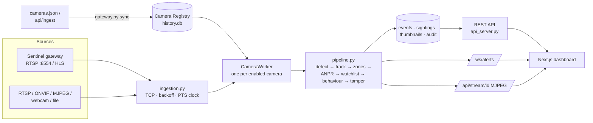

# PRAHARI / IBVAP — Complete Project Reference

> Features → files → API routes → frontend pages, plus every key/secret you need
> and every security item to watch. Generated from the code on 2026-09-28.
> For request/response shapes use the live Swagger UI at `http://localhost:8000/docs`
> or the snapshot in [`openapi.json`](openapi.json).

---

## Contents

1. [What the system is](#1-what-the-system-is)
2. [Architecture at a glance](#2-architecture-at-a-glance)
3. [API keys, credentials and config you must provide](#3-api-keys-credentials-and-config-you-must-provide)
4. [Connecting the live Gujarat feed (Sentinel gateway)](#4-connecting-the-live-gujarat-feed-sentinel-gateway)
5. [Feature map — feature → backend files → API routes → frontend page](#5-feature-map)
6. [Every API route](#6-every-api-route)
7. [Every backend file](#7-every-backend-file)
8. [Every frontend route, component and lib file](#8-every-frontend-route-component-and-lib-file)
9. [Every environment variable](#9-every-environment-variable)
10. [Security — what's done, what to watch](#10-security--whats-done-what-to-watch)
11. [Known gaps and remaining work](#11-known-gaps-and-remaining-work)
12. [Tests](#12-tests)
13. [Running it](#13-running-it)

---

## 1. What the system is

PRAHARI (IBVAP core) is an AI video-analytics platform for the Gujarat State Police CCTV network.
It ingests live camera feeds (the Sentinel Gujarat gateway over RTSP/HLS, plus RTSP / ONVIF /
MJPEG / webcam / file sources), runs detection → tracking → zone rules → ANPR → behaviour /
tamper analytics per camera, and pushes alerts to a Next.js control-room dashboard in real time.

**Stack:** Python · FastAPI · Uvicorn · PyTorch · Ultralytics YOLO11 · Supervision (ByteTrack) ·
OpenCV (FFmpeg) · PaddleOCR · SQLite · Next.js 14 · React 18 · TypeScript · Tailwind · Recharts ·
Leaflet (CARTO/OSM tiles) · Google Gemini (optional).

---

## 2. Architecture at a glance



- One **CameraWorker** thread per enabled registry camera; each owns its own capture, pipeline,
  zones and thermal toggle.
- Everything persists to one SQLite file, `backend/history.db` (WAL mode): cameras, events,
  sightings, watchlist, users, sessions, audit log.
- The dashboard never talks to cameras directly — it gets the annotated MJPEG stream and alerts
  from the backend, so gateway credentials never reach the browser.

---

## 3. API keys, credentials and config you must provide

| Item | Required? | Where | Notes |
|---|---|---|---|
| `IBVAP_GATEWAY_EMAIL` | **Yes** (live feed) | `backend/.env` | The email the organisers registered. Type `@` normally — the code sends it as `%40`. |
| `IBVAP_GATEWAY_PASSWORD` | **Yes** (live feed) | `backend/.env` | The portal's *access password*. Never in the frontend, a commit, a screenshot or an AI prompt. |
| `IBVAP_GATEWAY_CATALOG` | **Yes** (live feed) | `backend/.env` | Path to a `cameras.json` saved from your logged-in browser, **or** the URL + a cookie (below). |
| `IBVAP_GATEWAY_COOKIE` | Only if `IBVAP_GATEWAY_CATALOG` is a URL | `backend/.env` | Session cookie from the logged-in portal. Expires; treat like a password. |
| `IBVAP_HLS_COOKIE` | Only if `IBVAP_GATEWAY_TRANSPORT=hls` | `backend/.env` | Same session cookie, passed to FFmpeg for HLS. |
| `GEMINI_API_KEY` | Optional | `backend/.env` | Only for the History "AI explanation" button. Get one at aistudio.google.com/apikey. |
| `GEMINI_MODEL` | Optional | `backend/.env` | Code default is `gemini-3.8-flash` — **verify it's a real model id**, else set one that is. |
| `NEXT_PUBLIC_API_BASE` | Only if backend isn't `http://localhost:8000` | `frontend/.env.local` | e.g. `https://prahari.example.in`. Public (bundled into JS) — never a secret. |
| `NEXT_PUBLIC_WS_ALERTS_URL` | Optional | `frontend/.env.local` | Defaults to `API_BASE` with `ws://` + `/ws/alerts`. |
| `IBVAP_WEAPON_MODEL` | Optional | `backend/.env` | Path to a weapon-detection `.pt`. Stage is off without it. |

**No other API keys are needed.** YOLO weights, PaddleOCR, Re-ID and Zero-DCE all run locally.
Maps use public CARTO/OpenStreetMap tiles (no key).

Minimal `backend/.env` for the hackathon demo:

```dotenv
# Live gateway
IBVAP_GATEWAY_CATALOG=D:\IBVAP-main\backend\gateway_cameras.json
IBVAP_GATEWAY_EMAIL=you@example.com
IBVAP_GATEWAY_PASSWORD=...
IBVAP_GATEWAY_TRANSPORT=rtsp
IBVAP_GATEWAY_ACTIVE=cam01,cam04,cam12,cam17
IBVAP_GATEWAY_DEPARTMENT=Traffic Police

# Optional
GEMINI_API_KEY=
# GEMINI_MODEL=<a real Gemini model id>

# Demo hygiene
IBVAP_ENABLE_DEMO_HOOKS=0
IBVAP_CORS_ORIGINS=http://localhost:3000
```

`.env` is gitignored (root `.env` and `backend/.env`). Confirm with `git status` that it never shows up.

---

## 4. Connecting the live Gujarat feed (Sentinel gateway)

### 4.1 Gateway endpoints

| Protocol | Endpoint | Used by PRAHARI? |
|---|---|---|
| RTSP | `rtsp://<email%40…>:<password>@103.250.160.189:8554/stream/<id>` | **Yes — default** for AI inference |
| HLS | `https://cctv.corp8.cloud/<id>/index.m3u8` (needs login session) | Fallback (`IBVAP_GATEWAY_TRANSPORT=hls`) when port 8554 is blocked |
| WebRTC (WHEP) | `http://<email>:<password>@103.250.160.189:8889/stream/<id>/whep` | **No** — would expose credentials to the browser |
| Catalogue | `https://cctv.corp8.cloud/cameras.json` (also `/api/ingest`) | **Yes** — the camera list is always read from here |

Camera ids are `cam01` … `cam30`, but **the catalogue is the contract** — never hard-code ids.

### 4.2 Step by step

1. Log in to `https://cctv.corp8.cloud` in your browser, open `https://cctv.corp8.cloud/cameras.json`,
   **Save As** `backend/gateway_cameras.json`.
2. Fill in `backend/.env` (section 3).
3. Remove the demo cameras CAM-01…CAM-04 (Registry page → delete), or delete `backend/history.db`
   to start clean. The demo seeds are only created on an empty DB and are skipped when a
   catalogue is configured.
4. Test one camera from `backend/`:
   ```bash
   python -c "from dotenv import load_dotenv; load_dotenv(); from src.ingestion import open_source; s=open_source('rtsp://103.250.160.189:8554/stream/cam04', name='cam04'); g=s.frames(); [next(g) for _ in range(50)]; print(s.stats()); s.release()"
   ```
   `connected: True` + a codec and resolution = working. Endless retries = port 8554 blocked
   (use HLS) or wrong credentials.
5. Start the backend and frontend (section 13). The **Live Feed** page now shows the gateway
   cameras with AI overlays.

### 4.3 Gateway DO / DON'T rules and how the code honours them

| Rule | Implementation |
|---|---|
| DO force RTSP over TCP | `ingestion.py` sets `OPENCV_FFMPEG_CAPTURE_OPTIONS=rtsp_transport;tcp` before OpenCV loads; network streams use the FFmpeg backend explicitly |
| DON'T trust `CAP_PROP_FPS` | Never used for timing. `VideoSource.fps` is measured from PTS deltas and is informational only |
| DO drive timing from PTS, never arrival time | `PtsClock` (ingestion.py) + `MediaIndex` (timing.py). Dwell, loitering, events and route sightings use PTS-anchored time |
| DON'T assume a constant frame rate | Gaps < `IBVAP_PTS_GAP_DISCONTINUITY_S` (10 s) are normal; a newest-frame-only reader thread drops stale frames |
| DO reconnect with backoff | 2 → 4 → 8 → 16 → 30 s cap, forever, with jitter; resets only after a frame arrives; a failed initial connect is retried too |
| DON'T treat join-time decode warnings as fatal | FFmpeg logs them; only a failed read triggers a (backed-off) reconnect |
| DON'T assume a uniform grid | Codec / resolution reported per camera (`health.stream`); zones are percentage-based |
| DO expect a scene discontinuity (loop point) | `SceneCutDetector` + reconnect/PTS-jump detection reset tracks, plates, dwell and the tamper baseline; track ids never reused |
| DON'T plan on downloading footage | Only live capture; `/stream/<id>` is never curled |
| DON'T publish to the gateway | Consume only: GET on the catalogue, read streams — nothing else |
| DO pace your load | Only `IBVAP_GATEWAY_ACTIVE` (or first `IBVAP_GATEWAY_MAX_ACTIVE` live) cameras run; captures are released when a worker stops |
| Support reports need camera id, URL, client+version, UTC timestamp, error log | `GET /api/gateway/catalog` and each camera's `health.stream` give reconnects, last error, codec, redacted URL |

---

## 5. Feature map

| # | Feature | Backend files | API routes | Frontend page |
|---|---|---|---|---|
| 1 | **Live multi-camera streaming** (annotated MJPEG) | `api_server.py` (CameraWorker), `pipeline.py`, `ingestion.py` | `GET /api/stream/{id}` | `/live` (`components/video-panel.tsx`) |
| 2 | **Live gateway integration** (catalogue sync, TCP, backoff, PTS, scene cuts) | `gateway.py`, `ingestion.py`, `timing.py` | `POST /api/gateway/sync`, `GET /api/gateway/catalog` | — (admin API; status in camera health) |
| 3 | **Heterogeneous camera onboarding** (RTSP, ONVIF, HLS, MJPEG, webcam, file) | `ingestion.py` | via registry routes | `/registry` |
| 4 | **Camera registry + GIS map + CSV import/export** | `camera_store.py`, `api_server.py` | `GET/POST /api/cameras`, `GET/PUT/DELETE /api/cameras/{id}`, `POST /api/cameras/import`, `GET /api/cameras/export.csv` | `/registry` |
| 5 | **Person/vehicle detection + pose** | `detector.py` (YOLO11 + YOLO11-pose), `export_models.py` | (inside stream) | `/live` |
| 6 | **Multi-object tracking + Re-ID** | `tracker.py` (ByteTrack), `reid.py` | — | `/live` |
| 7 | **Restricted zones** (intrusion, loitering, climbing, fast approach) | `zones.py`, `zone_store.py` | `GET/PUT /api/zones/{id}` | `/zone-config` (also `/`) |
| 8 | **Real-time alerts** | `api_server.py` (`_publish_alert`) | `WS /ws/alerts` | `/live` (`components/animated-alert-list.tsx`) |
| 9 | **ANPR** (number plates) | `anpr.py` (PaddleOCR) | — | tagged on events/alerts |
| 10 | **Watchlist + match alerts** | `watchlist.py` | `GET/POST /api/watchlist`, `PUT /api/watchlist/{id}/active`, `DELETE /api/watchlist/{id}`, `POST /api/watchlist/simulate` (demo) | `/watchlist` |
| 11 | **Cross-camera route reconstruction** | `route.py`, `route_store.py`, `reid.py` | `GET /api/route/plates`, `GET /api/route/{plate}`, `POST /api/route/sighting` (demo) | `/route`, `/route/[plate]` |
| 12 | **Behaviour analytics** (loitering, altercation, snatching) | `behavior.py` | (alerts + history) | `/live`, `/history` |
| 13 | **Camera tamper / health** | `tamper.py` | `health` on camera routes | `/registry`, `/analytics` |
| 14 | **Low-light enhancement / thermal view** | `zero_dce.py`, `api_server.py` (`_apply_thermal_colormap`) | `GET/POST /api/thermal/{id}` | `/live` (video-panel toggle) |
| 15 | **Event history + thumbnails + CSV** | `history_store.py` | `GET /api/history`, `GET /api/history/thumbnail/{id}`, `GET /api/history/export.csv` | `/history` |
| 16 | **AI incident explanation** | `gemini_explainer.py` | `POST /api/history/{id}/explain` | `/history` |
| 17 | **Analytics dashboard + PDF report** | `history_store.py`, `api_server.py` (fpdf2) | `GET /api/analytics/summary`, `GET /api/analytics/report.pdf` | `/analytics` |
| 18 | **Auth + department RBAC** | `auth_store.py` | `POST /api/auth/login`, `POST /api/auth/logout`, `GET /api/auth/me` | `/login`, `components/sidebar.tsx` |
| 19 | **User management** (API only) | `auth_store.py` | `GET/POST /api/users`, `PUT/DELETE /api/users/{username}` | — (no UI yet) |
| 20 | **Audit log** | `audit_store.py` | `GET /api/audit` | `/audit` |
| 21 | **Privacy-redacted clip export** | `redaction.py` | `POST /api/export/redacted-clip` | `/audit` |
| 22 | **Weapon detection** (inactive without model) | `weapon.py` | (alerts) | — |
| 23 | **Face watchlist** (inactive, alert-and-verify only) | `facewatch.py` | (alerts) | — |
| 24 | **Health check** | `api_server.py` | `GET /api/health` | — |

---

## 6. Every API route

Base URL (dev): `http://localhost:8000`. Auth: `Authorization: Bearer <token>` on JSON calls;
`?token=<token>` on MJPEG, WebSocket, thumbnail and download links (browsers can't set headers
there). Roles: **viewer < operator < admin**. Camera-bound routes are also **department-scoped**
(admins see all).

### Auth & users

| Method | Path | Role | Purpose | Frontend caller |
|---|---|---|---|---|
| POST | `/api/auth/login` | public | Username/password → session token. Rate-limited per IP+username (429 after `IBVAP_LOGIN_RATE_LIMIT_MAX_FAILURES`) | `lib/auth.ts` → `/login` |
| POST | `/api/auth/logout` | any | Revoke the current session | `lib/auth.ts` |
| GET | `/api/auth/me` | any | Current user (role, department) | `lib/auth.ts` |
| GET | `/api/users` | admin | List users | — |
| POST | `/api/users` | admin | Create user `{username,password,role,department,display_name?}` | — |
| PUT | `/api/users/{username}` | admin | Change password / role / department / display name | — |
| DELETE | `/api/users/{username}` | admin | Delete user + their sessions (can't delete yourself) | — |

### Cameras, streaming, gateway

| Method | Path | Role | Purpose | Frontend caller |
|---|---|---|---|---|
| GET | `/api/cameras` | any | Dept-scoped registry + live status (`streaming`, `connectivity`, `health`, `health.stream`) | `lib/cameras.ts` |
| GET | `/api/cameras/{id}` | any | One camera | `lib/cameras.ts` |
| POST | `/api/cameras` | operator | Add camera; worker starts immediately | `lib/cameras.ts` → `/registry` |
| PUT | `/api/cameras/{id}` | operator | Edit; worker restarts if source/enabled changed | `lib/cameras.ts` |
| DELETE | `/api/cameras/{id}` | operator | Remove + stop worker | `lib/cameras.ts` |
| POST | `/api/cameras/import` | operator | CSV bulk onboarding (`id,name,department,lat,lon,source_spec,ownership,storage_details,enabled`), size-capped | `lib/cameras.ts` |
| GET | `/api/cameras/export.csv` | operator | Registry CSV | `lib/cameras.ts` |
| GET | `/api/stream/{id}` | any (`?token`) | Annotated MJPEG stream (audited) | `app/live/page.tsx` |
| GET | `/api/thermal/{id}` | any | Is night-vision on for this camera | `components/video-panel.tsx` |
| POST | `/api/thermal/{id}` | operator | Toggle night-vision / thermal view | `components/video-panel.tsx` |
| POST | `/api/gateway/sync` | admin | Re-read the gateway catalogue, upsert registry, start/stop workers. Body `{"apply_active": true}` re-applies `IBVAP_GATEWAY_ACTIVE` | — |
| GET | `/api/gateway/catalog` | operator | Last catalogue read + per-camera transport stats | — |

### Zones

| Method | Path | Role | Purpose | Frontend caller |
|---|---|---|---|---|
| GET | `/api/zones/{id}` | any | Camera's zone polygons (percent coordinates) | `lib/zones.ts` |
| PUT | `/api/zones/{id}` | operator | Replace zones; applied live to the worker | `lib/zones.ts` → `/zone-config` |

### Alerts

| Method | Path | Role | Purpose | Frontend caller |
|---|---|---|---|---|
| WS | `/ws/alerts?token=…` | any | Real-time alerts, filtered per connection to the user's departments | `app/live/page.tsx` |

### Watchlist

| Method | Path | Role | Purpose | Frontend caller |
|---|---|---|---|---|
| GET | `/api/watchlist` | any | List watchlisted plates | `lib/watchlist.ts` |
| POST | `/api/watchlist` | operator | Add plate `{plate,label,severity}` | `lib/watchlist.ts` |
| PUT | `/api/watchlist/{entry_id}/active` | operator | Enable/disable entry | `lib/watchlist.ts` |
| DELETE | `/api/watchlist/{entry_id}` | operator | Remove entry | `lib/watchlist.ts` |
| POST | `/api/watchlist/simulate` | operator | **Demo hook** — pretend a camera read a plate (off when `IBVAP_ENABLE_DEMO_HOOKS=0`) | `lib/watchlist.ts` |

### Route reconstruction

| Method | Path | Role | Purpose | Frontend caller |
|---|---|---|---|---|
| GET | `/api/route/plates` | any | Plates with sightings (picker) | `lib/route.ts` → `/route` |
| GET | `/api/route/{plate}?fuse_reid=&use_topology=` | any | Ordered cross-camera route with plausibility scoring | `lib/route.ts` → `/route/[plate]` |
| POST | `/api/route/sighting` | operator | **Demo hook** — inject a sighting | `lib/route.ts` |

### History, analytics, audit, export

| Method | Path | Role | Purpose | Frontend caller |
|---|---|---|---|---|
| GET | `/api/history?camera_id=&severity=&since_hours=&limit=&offset=` | any | Dept-scoped event log | `lib/history.ts` → `/history` |
| GET | `/api/history/thumbnail/{event_id}` | any (`?token`) | Event snapshot JPEG | `lib/history.ts` |
| POST | `/api/history/{event_id}/explain` | operator | Gemini plain-language explanation (cached) | `lib/history.ts` |
| GET | `/api/history/export.csv` | operator | CSV export (max 5000 rows) | `lib/history.ts` |
| GET | `/api/analytics/summary?since_hours=` | any | Totals by severity/camera + camera health | `lib/analytics.ts` → `/analytics` |
| GET | `/api/analytics/report.pdf` | any | Operational PDF report | `app/analytics/page.tsx` |
| GET | `/api/audit?limit=&offset=&username=&action=` | operator | Audit trail | `lib/audit.ts` → `/audit` |
| POST | `/api/export/redacted-clip` | operator | Export a clip with bystanders pixelated | `lib/audit.ts` |
| GET | `/api/health` | public | Liveness/readiness | — |

---

## 7. Every backend file

### `backend/src/`

| File | What it does |
|---|---|
| `api_server.py` | FastAPI app: all routes above, CameraWorker threads, alert fan-out, auth dependencies, CORS, login throttling, gateway sync + periodic resync, OpenAPI tagging |
| `ingestion.py` | Source adapters (`VideoSource` for RTSP/HLS/webcam/file, `MjpegHttpSource`, ONVIF resolver), `open_source()` factory, TCP forcing, backoff, `PtsClock`, gateway credential injection, URL redaction |
| `gateway.py` | Sentinel catalogue fetch/parse (`cameras.json` / `/api/ingest`), registry upsert, load pacing, credential stripping |
| `timing.py` | `MediaIndex` (PTS → frame index at a nominal rate), `SceneCutDetector` (loop-point hard cuts) |
| `pipeline.py` | Per-camera loop: timing → enhance → detect → track → ANPR/watchlist → route sightings → zones → analytics; scene-state reset |
| `detector.py` | YOLO11 base detector + YOLO11-pose (two-model, top-down) |
| `tracker.py` | ByteTrack wrapper, centroid history, sparse Re-ID, `reset()` with non-reused ids |
| `reid.py` | Appearance embedder (MobileNetV2-based) + global cross-camera target registry |
| `zones.py` | Zone polygons, intrusion/exit, loitering, climbing (pose), approach velocity |
| `zone_store.py` | Per-camera zone persistence |
| `anpr.py` | Event-driven plate OCR (PaddleOCR); disables cleanly if not installed |
| `watchlist.py` | Watchlist table, plate normalisation, matching |
| `route.py` | Route reconstruction: ordering, transit plausibility (geo or `topology.json`), Re-ID fusion |
| `route_store.py` | Vehicle sightings table (plate, embedding, time, camera) |
| `behavior.py` | Loitering / altercation / snatching from pose keypoints |
| `tamper.py` | Covered / blurred / moved / black-frame camera detection |
| `weapon.py` | Two-stage weapon detection (needs `IBVAP_WEAPON_MODEL`) |
| `facewatch.py` | Face-watchlist alert-and-verify stage (needs an embedder; off by default) |
| `zero_dce.py` | Zero-DCE++ / CLAHE low-light enhancement |
| `redaction.py` | Pixelates bystanders for privacy-safe exports |
| `history_store.py` | Events table, thumbnails, monotonic timestamps, summary stats |
| `camera_store.py` | Camera Registry table (source of truth for cameras) |
| `auth_store.py` | Users, PBKDF2 password hashing, sessions, roles, department checks, demo seeds |
| `audit_store.py` | Append-only audit log |
| `gemini_explainer.py` | Gemini call for event explanations |
| `export_models.py` | Export YOLO weights to optimised formats (ONNX/TensorRT) |

### Data and other files (all gitignored)

| Path | Content |
|---|---|
| `backend/history.db` (+ `-wal`, `-shm`) | All tables — **contains plates, events, users, audit; real personal data once live** |
| `backend/history_thumbnails/` | Event snapshots — **real faces/plates once live** |
| `backend/exports/` | Redacted clip exports |
| `backend/zone_config.json` | Legacy zone config |
| `backend/models/*.pt, *.pth`, `backend/yolo11n*.pt` | Model weights |
| `backend/.env` | Secrets |
| `backend/gateway_cameras.json` | Saved gateway catalogue |

---

## 8. Every frontend route, component and lib file

### Pages (`frontend/app/`)

| URL | File | What it shows | Uses |
|---|---|---|---|
| `/login` | `login/page.tsx` | Sign-in | `lib/auth` |
| `/live` | `live/page.tsx` | Camera grid/feed (MJPEG), live alert list, thermal toggle | `lib/cameras`, `lib/config`, `lib/auth`, `lib/audit`, WS `/ws/alerts` |
| `/registry` | `registry/page.tsx` | Camera table + Leaflet map, add/edit/delete, CSV import/export | `lib/cameras`, `lib/leaflet` |
| `/watchlist` | `watchlist/page.tsx` | Plate watchlist + simulate hook | `lib/watchlist`, `lib/cameras` |
| `/route` | `route/page.tsx` | Plate picker | `lib/route`, `lib/cameras` |
| `/route/[plate]` | `route/[plate]/page.tsx` | Route timeline + map | `lib/route`, `lib/leaflet` |
| `/zone-config` | `zone-config/page.tsx` | Draw restricted-zone polygons | `lib/zones`, `lib/cameras` |
| `/` | `page.tsx` | **Currently a duplicate of the Zone Config page** (should redirect to `/live`) | `lib/zones`, `lib/cameras` |
| `/history` | `history/page.tsx` | Event log, thumbnails, AI explanation, CSV | `lib/history`, `lib/cameras` |
| `/audit` | `audit/page.tsx` | Audit trail + redacted export (operator+) | `lib/audit` |
| `/analytics` | `analytics/page.tsx` | KPIs, charts, camera health, PDF report | `lib/analytics`, `lib/cameras` |
| — | `layout.tsx` | Root layout / app shell | `components/app-shell` |

### Components (`frontend/components/`)

| File | Purpose |
|---|---|
| `app-shell.tsx` | Auth-gated layout wrapper |
| `sidebar.tsx` | Nav (Live Feed, Registry, Watchlist, Route, Zone Config, History, Audit Log [operator+], Analytics) |
| `video-panel.tsx` | MJPEG player + thermal toggle (`/api/thermal/{id}`) |
| `animated-alert-list.tsx` | Live alert feed |
| `bento-grid.tsx` | Dashboard tile layout |
| `severity-badge.tsx` | Severity chip |

### Lib (`frontend/lib/`)

| File | Purpose / API calls |
|---|---|
| `config.ts` | `API_BASE` (`NEXT_PUBLIC_API_BASE`), `WS_ALERTS_URL` |
| `auth.ts` | Login/logout/me, token storage (**localStorage**), `apiFetch`, `withToken` |
| `cameras.ts` | `/api/cameras*` |
| `zones.ts` | `/api/zones/{id}` |
| `watchlist.ts` | `/api/watchlist*` |
| `route.ts` | `/api/route*` |
| `history.ts` | `/api/history*` |
| `analytics.ts` | `/api/analytics/summary` |
| `audit.ts` | `/api/audit`, `/api/export/redacted-clip` |
| `leaflet.ts` | Loads Leaflet from unpkg + CARTO dark tiles |
| `mock-data.ts` | Types/fallback data for some pages |
| `utils.ts` | Class-name helpers |

---

## 9. Every environment variable

### Backend (`backend/.env`)

| Variable | Default | Purpose |
|---|---|---|
| `IBVAP_GATEWAY_CATALOG` | — | Catalogue URL or local file; enables gateway mode |
| `IBVAP_GATEWAY_COOKIE` | — | Session cookie for a catalogue URL |
| `IBVAP_GATEWAY_EMAIL` / `IBVAP_GATEWAY_PASSWORD` | — | RTSP credentials (injected at open time only) |
| `IBVAP_GATEWAY_TRANSPORT` | `rtsp` | `rtsp` or `hls` |
| `IBVAP_GATEWAY_RTSP_BASE` | `rtsp://103.250.160.189:8554` | Fallback RTSP base |
| `IBVAP_GATEWAY_HLS_BASE` | `https://cctv.corp8.cloud` | Fallback HLS base |
| `IBVAP_GATEWAY_RTSP_HOSTS` | `103.250.160.189,stream.corp8.cloud` | Only these hosts receive gateway credentials |
| `IBVAP_GATEWAY_ACTIVE` | — | Ids to process, or `all` |
| `IBVAP_GATEWAY_MAX_ACTIVE` | `4` | Cap when `ACTIVE` unset |
| `IBVAP_GATEWAY_DEPARTMENT` | `Gujarat Police Sandbox` | Registry department for gateway cameras (**affects who can see them**) |
| `IBVAP_GATEWAY_RESYNC_INTERVAL_S` | `300` | Catalogue re-read interval (0 = off) |
| `IBVAP_HLS_COOKIE` | — | Cookie FFmpeg sends for HLS |
| `IBVAP_STREAM_OPEN_TIMEOUT_MS` | `10000` | Stream open timeout |
| `IBVAP_STREAM_READ_TIMEOUT_MS` | `15000` | Stream read timeout |
| `IBVAP_PTS_GAP_DISCONTINUITY_S` | `10` | PTS jump treated as a new timeline |
| `IBVAP_TRACK_FPS` | `15` | Nominal rate PTS is quantised to (not a camera rate) |
| `IBVAP_CORS_ORIGINS` | `http://localhost:3000` | Allowed dashboard origins |
| `IBVAP_SEED_DEMO_USERS` | `1` | Seed admin/rakesh/meena demo users |
| `IBVAP_ENABLE_DEMO_HOOKS` | `1` | Enable `/api/watchlist/simulate`, `/api/route/sighting` |
| `IBVAP_LOGIN_RATE_LIMIT_WINDOW_S` | `300` | Login failure window |
| `IBVAP_LOGIN_RATE_LIMIT_MAX_FAILURES` | `5` | Failures before 429 |
| `IBVAP_MAX_CSV_IMPORT_BYTES` | `200000` | CSV import cap |
| `IBVAP_WEAPON_MODEL` | — | Weapon model path |
| `GEMINI_API_KEY` | — | Gemini key |
| `GEMINI_MODEL` | `gemini-3.8-flash` | Gemini model id (verify) |
| `IBVAP_CAM0x_SOURCE` | — | Legacy: seed source for demo cameras on an empty DB |
| `OPENCV_FFMPEG_CAPTURE_OPTIONS` | set automatically | Leave unset; the code forces `rtsp_transport;tcp` |

### Frontend (`frontend/.env.local`)

| Variable | Default | Purpose |
|---|---|---|
| `NEXT_PUBLIC_API_BASE` | `http://localhost:8000` | Backend URL (public) |
| `NEXT_PUBLIC_WS_ALERTS_URL` | derived | Alerts WebSocket URL (public) |

---

## 10. Security — what's done, what to watch

### 10.1 Gateway credentials (highest priority)

- [x] Stored only in `backend/.env` (gitignored); injected into the RTSP URL at open time only.
- [x] Never stored in the registry DB, never returned by the API, redacted (`***@`) in logs and stats.
- [x] Only sent to hosts in `IBVAP_GATEWAY_RTSP_HOSTS`.
- [ ] **You:** never paste the password into chat, AI prompts, screenshots, slides or commits.
- [ ] **You:** check the backend console once — FFmpeg's own error output could print a full URL.
- [ ] If it ever leaks, ask the organisers to reset it.
- [x] The saved `backend/gateway_cameras.json` is gitignored; treat it and any cookie as sensitive.

### 10.2 Before the demo / submission

| Item | Status | Action |
|---|---|---|
| Demo users `admin/admin123`, `rakesh/traffic123`, `meena/viewer123` | ⚠️ seeded by default | Change passwords via `PUT /api/users/{username}`, or set `IBVAP_SEED_DEMO_USERS=0` (**but then no admin exists — see 10.3**) |
| Demo injection hooks | ⚠️ on by default | `IBVAP_ENABLE_DEMO_HOOKS=0` so only real detections appear |
| CORS | ✅ env-configurable | Set `IBVAP_CORS_ORIGINS` to the real dashboard origin only |
| `.env`, `history.db`, thumbnails, exports, weights | ✅ gitignored | Run `git status` before every commit |
| Real personal data (faces, plates) from live feeds | ⚠️ | Don't put screenshots with readable plates/faces in public repos or slides without need |

### 10.3 Open application-security issues

| # | Issue | Risk | Fix |
|---|---|---|---|
| 1 | No HTTPS | Tokens, MJPEG and passwords travel in clear text off localhost | Reverse proxy (Caddy/nginx) with TLS |
| 2 | Tokens in URLs (`?token=` on stream, WS, thumbnails, downloads) | Leak into logs/history | Short-lived, single-purpose signed URLs |
| 3 | Session token in `localStorage` | Readable by any injected script (XSS) | httpOnly cookie + CSRF protection, or strict CSP |
| 4 | Login throttle trusts `X-Forwarded-For` | Attacker bypasses rate limit by rotating the header | Only trust it from `IBVAP_TRUSTED_PROXIES` |
| 5 | Camera `source_spec` validation only blocks loopback/link-local | SSRF into private networks | Block private/metadata ranges unless allow-listed |
| 6 | `POST /api/export/redacted-clip` accepts an arbitrary `source_spec` without validation | Operator can read any local video file / probe internal URLs | Validate like camera sources, or only allow `camera_id` |
| 7 | No bootstrap admin when demo users are off | Fresh DB has no users → locked out | `IBVAP_BOOTSTRAP_ADMIN_USER/_PASSWORD` for an empty users table |
| 8 | `history.db` + thumbnails unencrypted, no retention | Privacy of plates/faces | Encrypted volume, retention job (e.g. delete > 30 days) |
| 9 | Audit log is DB-writable | Not tamper-evident | Hash-chain entries or WORM storage |
| 10 | Model weights auto-download without checksum | Supply-chain risk | Pin versions, verify SHA-256, host internally |
| 11 | No MFA / SSO | Password-only access | OIDC/SSO for real deployment |
| 12 | Face watchlist (if ever enabled) | Legal/ethical | Alert-and-verify only, logged, lawful basis, threshold tuning |

### 10.4 What is already in place

- PBKDF2 password hashing, server-side sessions with expiry.
- Role-based access (viewer/operator/admin) on every route.
- Department scoping on cameras, streams, zones, history, thumbnails, analytics, PDF, WebSocket alerts.
- Login rate limiting, CSV size cap, loopback/link-local source blocking.
- Append-only audit log of logins, views, searches, edits, exports.
- Privacy-redacted exports.

---

## 11. Known gaps and remaining work

**Must do for submission**
1. **FPS:** PyTorch is the CPU build (`torch 2.10.0+cpu`) but the machine has an RTX 4060. Install a CUDA build of torch/torchvision — this is the main reason for ~1.9 fps.
2. Connect the live feed (section 4) and verify the real `cameras.json` field names match what `gateway.py` expects (the parser is tolerant, but it was built without a real sample).
3. Gateway cameras default to department `Gujarat Police Sandbox`, so demo users `rakesh`/`meena` see nothing — set `IBVAP_GATEWAY_DEPARTMENT` or create users in that department.
4. Zone-config canvas uses a synthetic background — zones should be drawn on a real frame from each live camera.
5. `/` duplicates the Zone Config page — make it redirect to `/live`.
6. Install missing packages: `pip install -r backend/requirements.txt` (PaddleOCR not installed → live ANPR off).
7. Verify the Gemini model id.

**Performance**

8. Share one YOLO model across cameras instead of one per worker; batch inference.
9. Expose per-camera *processing* fps and inference latency.
10. GPU for PaddleOCR and Re-ID; tune ANPR / Re-ID intervals.

**Correctness**

11. `behavior.py` / `zones.py` speed checks may assume one frame between observations — use the actual index delta.
12. Pin `supervision<0.31` (ByteTrack is deprecated there).

**Product**

13. User-management UI (API exists).
14. Bootstrap admin (security #7).

**Scale / ops (post-hackathon)**

15. PostgreSQL + PostGIS instead of SQLite.
16. Dockerfile, docker-compose, CI running the test suite.
17. Security items 10.3.
18. Optional: weapon model, face watchlist (with governance), road `topology.json`.

---

## 12. Tests

Plain Python runners — run from `backend/`:

| File | Covers |
|---|---|
| `tests/test_phase0_timestamps.py` | Event timestamp ordering under concurrency |
| `tests/test_phase1_adapters.py` | All source adapters share one frame contract |
| `tests/test_phase2_registry.py` | Registry CRUD, runtime add/remove, CSV import |
| `tests/test_phase3_watchlist.py` | Watchlist matching + real-time alert |
| `tests/test_phase4_route.py` | Route reconstruction |
| `tests/test_phase5_security.py` | Auth, RBAC, audit |
| `tests/test_phase6_analytics.py` | Tamper / behaviour / weapon / face stages |
| `tests/test_phase9_live_gateway.py` | Gateway rules: TCP, PTS timing, backoff, catalogue, scene cuts |
| `tests/test_anpr.py` | ANPR engine |
| `tests/run_pipeline_smoke_test.py` | Real YOLO pipeline on the sample clip |

```bash
python tests/test_phase9_live_gateway.py
```

---

## 13. Running it

Backend (from `backend/`):

```bash
pip install -r requirements.txt
```

```bash
python -m uvicorn src.api_server:app --port 8000
```

Frontend (from `frontend/`):

```bash
npm install
```

```bash
npm run dev
```

Open `http://localhost:3000`, sign in, go to **Live Feed**. API docs at `http://localhost:8000/docs`.
