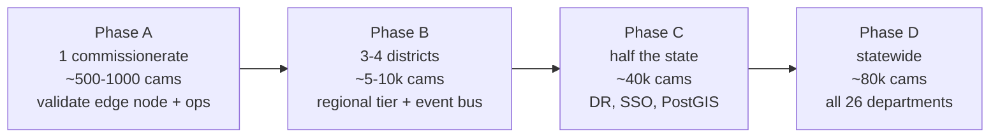

# Scale-Up Plan — to ~80,000 cameras statewide

This plan scales the PRAHARI/IBVAP architecture from a single-node PoC to a Gujarat-wide
deployment of ~80,000 cameras across 26 departments. The central design decision is
**edge-first processing**: analytics run next to the cameras, and only compact events (plus
on-demand video) travel upstream. That is what makes the bandwidth, compute, and storage
tractable.

---

## 1. Tiered (federation) architecture

```mermaid
flowchart TB
  subgraph Edge["Edge tier — PS / district nodes (~800-1600 nodes)"]
    E1["Edge node<br/>50-100 cameras<br/>GPU inference + local VMS<br/>30-day video retention"]
  end
  subgraph Regional["Regional tier — range/zone aggregators (~30-40)"]
    R1["Event bus + regional DB<br/>correlation, cross-node Re-ID<br/>video proxy/cache"]
  end
  subgraph State["State tier — GSP data centre (+DR)"]
    S1["Statewide registry, watchlist,<br/>route reconstruction, dashboards,<br/>audit, long-term metadata"]
  end
  Cameras["~80,000 cameras"] --> E1 --> R1 --> S1
  S1 -. on-demand video pull .-> R1 -. .-> E1
```

- **Edge node** = today's PoC unit, hardened: it runs the ingestion adapters + CV pipeline for
  its camera cluster, keeps raw video locally, and emits events/alerts + thumbnails upstream.
  This is exactly where the current per-camera `CameraWorker` design lands — the ingestion
  contract (see [HLD §4](HLD.md#4-ingestion-adapter-layer-federation-forward)) is the seam.
- **Regional tier** = the Model 3 federation/event-bus layer: aggregates edge events, does
  cross-node correlation (route reconstruction spanning nodes), and proxies video on demand.
- **State tier** = registry, watchlist, statewide route/search, dashboards, audit, and the
  long-term metadata store.

---

## 2. Network & bandwidth — the edge-processing argument

| Approach | Per-camera uplink | 80,000 cameras |
|---|---|---|
| **Centralize raw video** (naïve) | ~2–4 Mbps (H.264 1080p) | **~240 Gbps sustained** — infeasible & costly |
| **Edge-process, ship events** (this design) | ~2–20 kbps (events, thumbnails, heartbeats) | **~0.2–1.6 Gbps** aggregate + bursty on-demand clip pulls |

Edge processing cuts the sustained statewide uplink by **~99%+**. Raw video stays local to the
edge node; the state/regional tiers pull specific clips **only on demand** (an investigation, a
redacted export, an alert review). Metadata (events, plate reads, sightings, health) is tiny and
is what powers registry/search/route/analytics centrally.

---

## 3. AI processing capacity

Assumptions (tunable): analytics at **5–10 fps** per camera (not full frame rate), YOLO11n-class
models, batched inference on the edge GPU.

| Item | Estimate |
|---|---|
| Cameras per edge GPU (batched, 5–10 fps, n-size models) | ~20–40 |
| Edge GPUs for 80k cameras | ~2,000–4,000 GPUs (e.g. L4 / A2 / Orin-class) |
| Edge nodes (50–100 cams, 1–3 GPUs each) | ~800–1,600 nodes |
| Regional aggregators | ~30–40 (one per range/commissionerate) |

Cost/compute levers: adaptive frame-skipping, motion-gated inference (skip static scenes),
model right-sizing per use case (tampering/behavior are GPU-free; ANPR/weapon/face are the GPU
consumers), TensorRT/OpenVINO compilation (already supported in `detector.py`), and
cascading (cheap detector gates the expensive second stage).

---

## 4. Storage & retention

| Data | Where | Retention | Rough size |
|---|---|---|---|
| Raw video | Edge node (local NVR/VMS) | 30 days (policy-driven) | ~30 GB/cam/30d @ ~1 Mbps CBR → ~2.4 PB statewide at edge, distributed |
| Event metadata + thumbnails | Regional → State | 1–3 years | KB–tens of KB per event; easily terabytes centrally, not petabytes |
| Sightings / embeddings | Regional | 30–90 days (rolling) | small; pruned (see `route_store` cap) |
| Audit log | State | 3+ years (compliance) | small, append-only |
| Redacted exports / evidence | State evidence store (WORM) | per case | on demand |

Video is deliberately **not** centralized; only compact metadata and requested clips move up. The
PoC's SQLite stores become PostgreSQL/PostGIS (registry + GIS) and a time-series/object store at
scale.

---

## 5. Software scale path (what changes from the PoC)

| PoC | At scale |
|---|---|
| SQLite (`history.db`, WAL) | PostgreSQL + **PostGIS** (registry/GIS), object store for thumbnails/clips |
| In-process alert `queue.Queue` → WebSocket | Message bus (Kafka/NATS) for the regional event bus |
| Per-process camera workers | Orchestrated edge workloads (K3s/containers) with health + auto-restart |
| In-memory Re-ID registry per camera | Regional vector store for cross-node appearance matching |
| Token sessions in SQLite | Central IdP (OAuth/SSO) + backend-enforced tokens (RBAC already modelled) |
| Geo-derived topology | Curated road-topology graph per region (the `topology.json` override, at scale) |

The application code is already layered for this: stores are isolated modules, ingestion is a
pluggable factory, and the alert transport is a single seam.

---

## 6. Disaster recovery & availability

- **Edge:** local buffering means a WAN outage doesn't drop analytics; events queue and
  back-fill when the link returns. N+1 GPU per node for hardware failure.
- **Regional/State:** active-active regional aggregators; the state tier replicated to a **DR
  site** (async replication of metadata + audit; object store cross-region replication).
- **Degrade gracefully:** if the state tier is down, edge/regional continue detecting and
  alerting locally — the same "graceful fallback" philosophy already in the PoC (ANPR/weapon/face
  disable cleanly; the UI falls back when the WebSocket is unreachable).
- **RPO/RTO targets:** metadata RPO ≤ 5 min (async replication), RTO ≤ 1 hour for the state tier;
  edge analytics have no hard dependency on the centre.

---

## 7. Statewide rollout (phased)



Each phase onboards cameras through the **registry** (manual / CSV / API — already built), so
scale-out is an operational activity, not a re-architecture. Department-by-department onboarding
maps cleanly onto the RBAC department scoping already implemented.

See [COST_BENEFIT_AND_ROADMAP.md](COST_BENEFIT_AND_ROADMAP.md) for cost bands, the 26-department
information matrix, and the Model 3/Model 4 roadmap.
